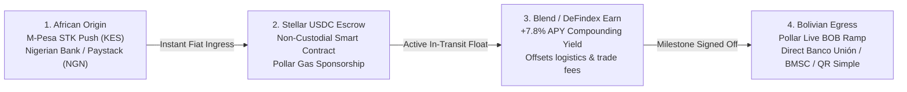

# char ⚡

> **The Direct Africa ⇄ Latin America Settlement & Yield Escrow Corridor on Stellar & Pollar**  
> *Flagship Hackathon Submission for the Africa–Latin America Corridor Challenge*

---

## 🌍 The Problem

Cross-continental trade between Africa and Latin America (e.g. Bolivian specialty coffee exports, quinoa, agricultural machinery, or cross-border software engineering) currently depends on legacy correspondent banking (SWIFT).

1. **Slow & Intermediated:** Routing goes through 3–5 correspondent banks in New York and Frankfurt, taking **5 to 7 business days**.
2. **Predatory Double FX Haircut:** African fiat (KES / NGN) is converted to USD, and then USD is converted to Bolivian Bolivianos (BOB), losing **8% to 12%** in spreads and wire fees.
3. **Zero Yield on In-Transit Capital:** Escrow funds sit completely dead for 2–3 weeks while goods are shipped across the Atlantic.

---

## 🚀 The `char` Solution

`char` establishes a direct South-South atomic settlement corridor connecting **African local currency rails** directly to **Pollar's live Bolivian (BOB) fiat ramp** over the **Stellar Network**, with an active **Blend lending pool yield engine** that earns interest on escrowed capital in transit.



---

## 💎 Key Features

- **Soft Neumorphic UI Design:** Sculpted tactile surfaces, concave/convex button interactions, and soft dual-shadow aesthetics tailored for high legibility and sensory feedback.
- **African Leg (Flagship Challenge):**
  - **M-Pesa STK Push Simulator:** Enter Kenyan phone number (`+254 7...`), interact with a simulated phone screen, enter 4-digit PIN, and trigger the webhook callback.
  - **Nigerian Bank Transfer Rail:** Instant virtual account generation (Wema/Titan Trust) with mock automated deposit listener.
  - **Pollar Embedded Wallet:** Direct gasless Stellar USDC transfer using FaceID / Passkey or Google login.
- **Yield-Bearing Escrow Engine:**
  - Locked USDC automatically stakes into **Blend Protocol** lending pools or **DeFindex vaults** via Pollar's Earn SDK (`pollar.earnDeposit`).
  - Real-time ticker visually compounds accrued interest every second.
- **Bolivian Cashout Terminal (Live BOB Ramp):**
  - Instant guaranteed 15-minute FX quote from USDC to Bolivian Bolivianos (BOB).
  - Direct payout routing into **Banco Unión**, **Banco Mercantil Santa Cruz (BMSC)**, **Banco Nacional de Bolivia (BNB)**, and **QR Simple**.

---

## 🛠️ Tech Stack & SDK Integration

- **Framework:** Next.js 14 (App Router), React 18, TypeScript, Tailwind CSS
- **Pollar Stack:**
  - `@pollar/react` (`PollarProvider`, `usePollar`, biometric passkey ceremony, embedded wallet)
  - `@pollar/core` (Stellar transaction construction, `getRampsQuote`, `createOffRamp`, `earnDeposit`)
- **Blockchain:** Stellar Network (Testnet & Mainnet USDC)
- **Yield Providers:** Blend Protocol lending pools & DeFindex vaults
- **Design System:** Custom Neumorphism / Soft UI with reactive shadow elevations

---

## 🏃 Getting Started

### 1. Clone & Install
```bash
git clone https://github.com/your-username/char.git
cd char
npm install
```

### 2. Configure Environment
Create a `.env.local` file (already pre-configured with sandbox fallback):
```env
NEXT_PUBLIC_POLLAR_PUBLISHABLE_KEY=pub_testnet_your_key_here
```
> *Tip: You can obtain your free testnet key in 60 seconds from [dashboard.pollar.xyz](https://dashboard.pollar.xyz), or simply run the app out-of-the-box in demo mode! You can also paste your live key directly into the settings modal inside the app.*

### 3. Run Development Server
```bash
npm run dev
```
Open [http://localhost:3000](http://localhost:3000) in your browser.

---

## 🧪 Demo Walkthrough (For Hackathon Judges)

1. **View the Corridor Highway:** Explore the real-time FX ticker bar and side-by-side comparison between the legacy SWIFT route vs. `char`.
2. **Inspect an Active Escrow:** Observe the second trade (*Specialty Yungas Geisha Coffee*), which is currently in transit with **live yield compounding in real-time**.
3. **Fund a Trade via African Rail:** Click **"Fund via M-Pesa / African Rail"** on any trade awaiting funding:
   - Select **M-Pesa 🇰🇪**, enter your phone number, click **"Send M-Pesa STK Prompt"**.
   - Watch the interactive USSD phone screen appear, enter your 4-digit PIN (e.g. `1234`), and confirm.
   - The trade immediately shifts into the **Blend Escrow Vault** with confetti celebration!
4. **Release & Settle in Bolivia (BOB):**
   - Click **"Confirm Inspection & Release Escrow"**.
   - Click **"Cash Out to Bank (Pollar Ramp)"**.
   - Select **Banco Unión** or **QR Simple**, review the guaranteed BOB rate, and click **"Off-Ramp to Bank"** to complete the corridor!

---

## 👥 Hackathon Team & Support

- **Built with:** Pollar SDK & Stellar
- **Pollar Community & Ramp Testing:** [Pollar Telegram](https://t.me/+R76f1BarXSUxMTQx)
- **Dashboard:** [dashboard.pollar.xyz](https://dashboard.pollar.xyz)
